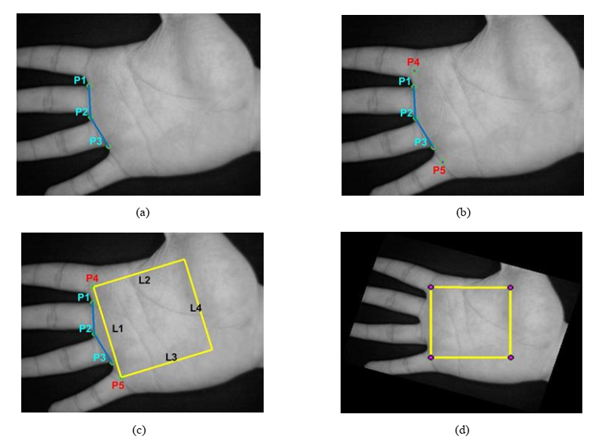

## Palmprint Identification using RBFN

This project presents an effective texture-based
approach for palmprint recognition. It has three major steps - 

 - First, region of interest (ROI) is extracted from the hand image.
 - Then, features are extracted in the processing stage from the
palmprint texture using discrete cosine transform (DCT). Block-wise DCT and Holistic DCT 
are used to extract features. 
- Finally, radial basis function network (RBFN) is used for classification.
 
#### Dataset
[CASIA Database](http://www.cbsr.ia.ac.cn/english/Palmprint%20Databases.asp "CASIA_database")

#### Training
First run either of `blockDCT_train.m` or `HolisticDCT_Train.m`.
Then run either of `Palm_RBF_V1.m` or `Palm_RBF_V2.m`.

#### Screen shot

#### Reference
[1] https://www.mathworks.com/matlabcentral/fileexchange/46573-roi-of-palmprint-images)

[here](https://github.com/mou58/palmprint_identification)
